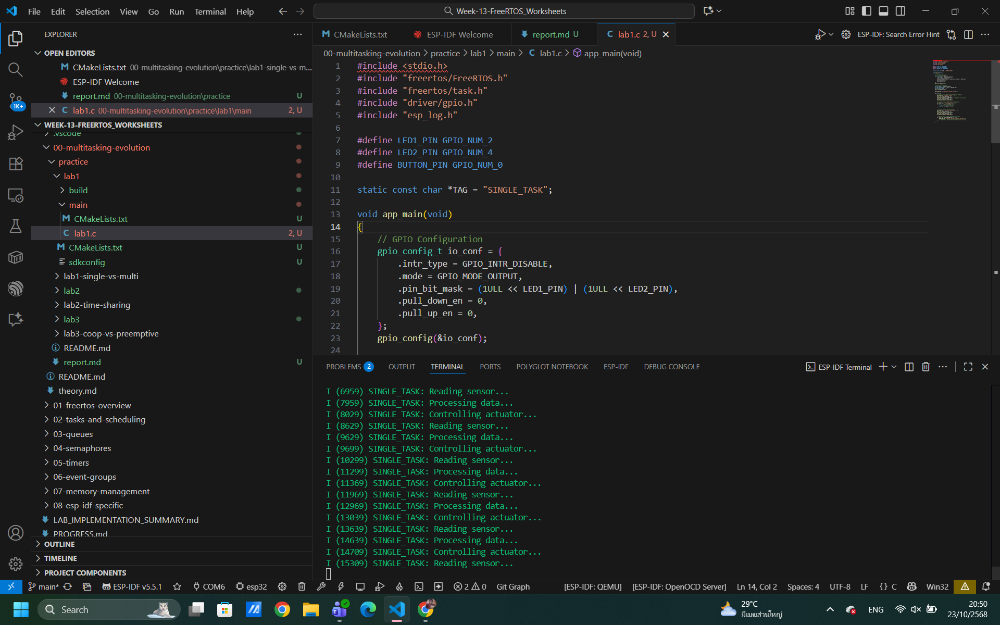
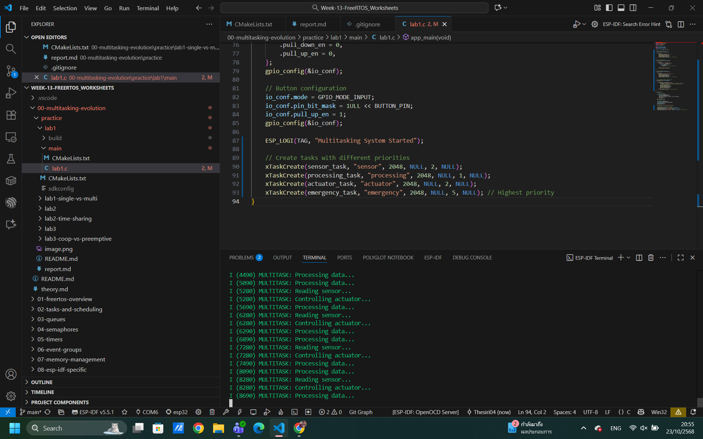
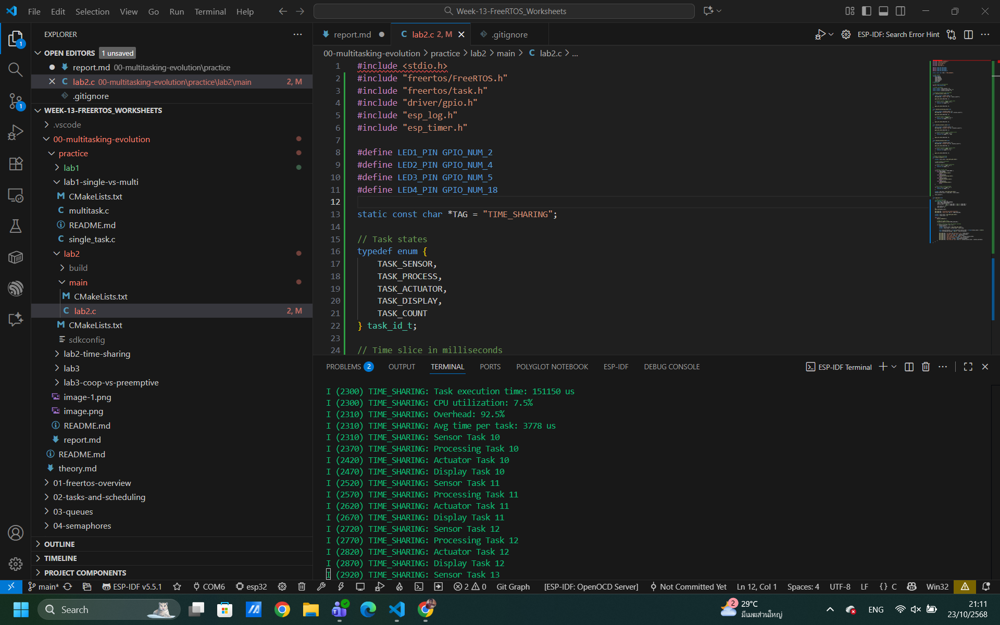
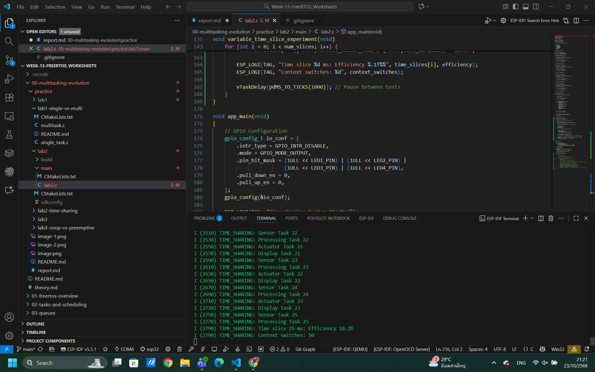
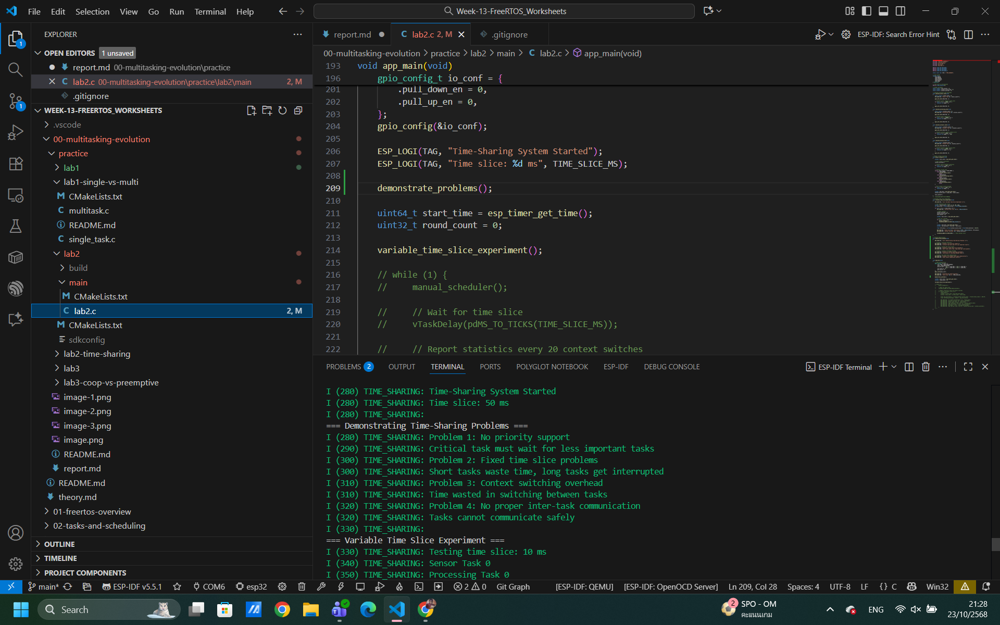
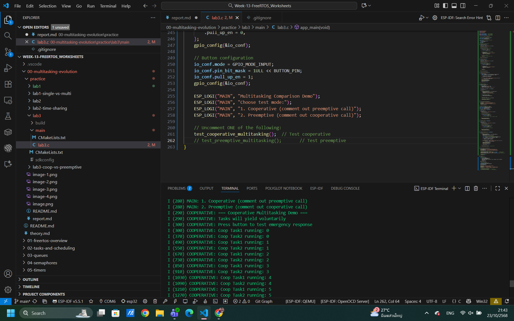
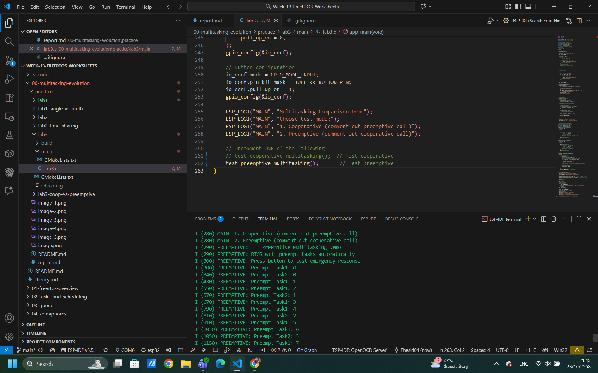

lab1 
Part 1: Single Task System

Part 2: Multitasking System

Part 3: เปรียบเทียบและวิเคราะห์
Single task ไฟจะติดทีบะตัว แต่แบบ multi ไฟจิดแทบจะพร้อมกัน

lab2
Part 1

Part 2

Part 3

lab3
Part 1: Cooperative Multitasking

Part 2: Preemptive Multitasking

