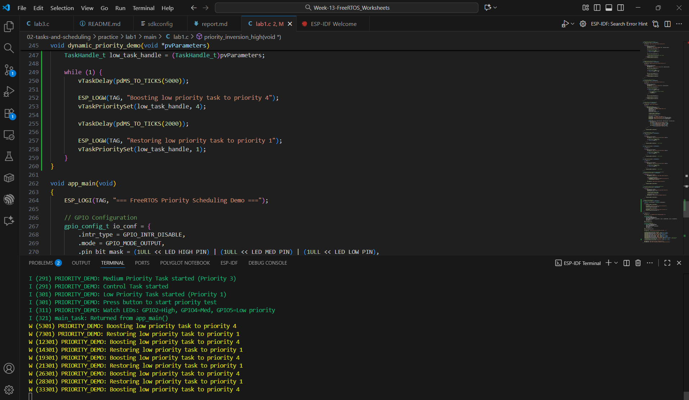
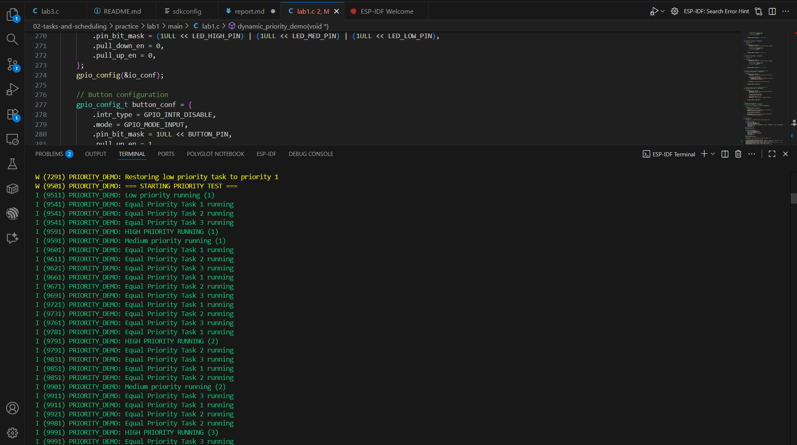
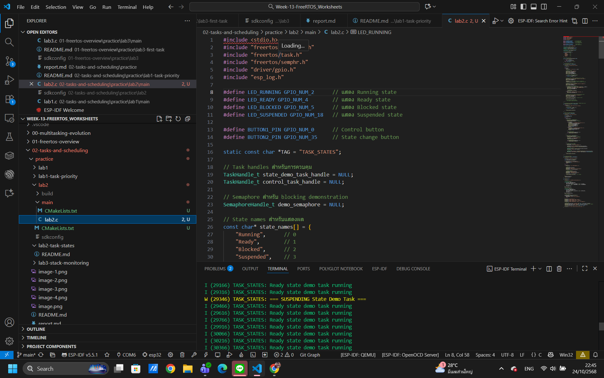
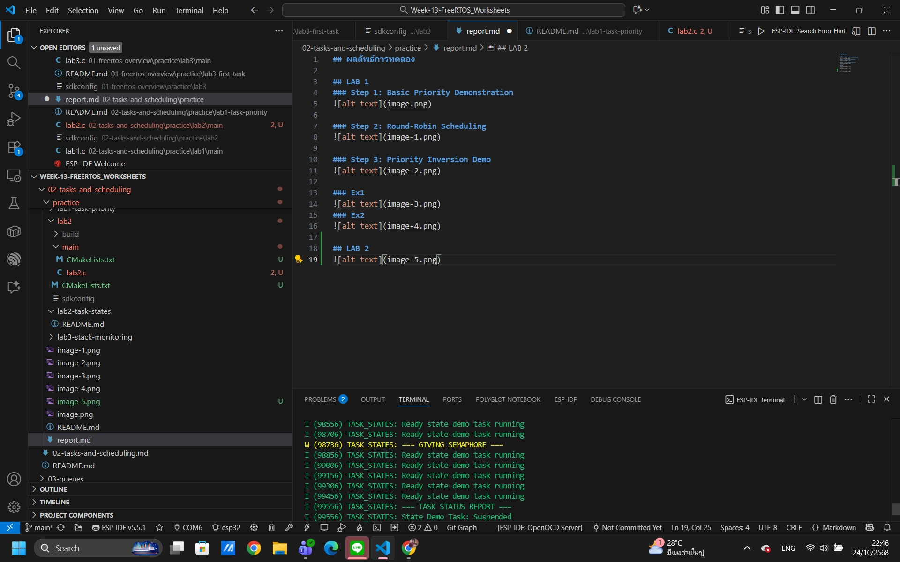
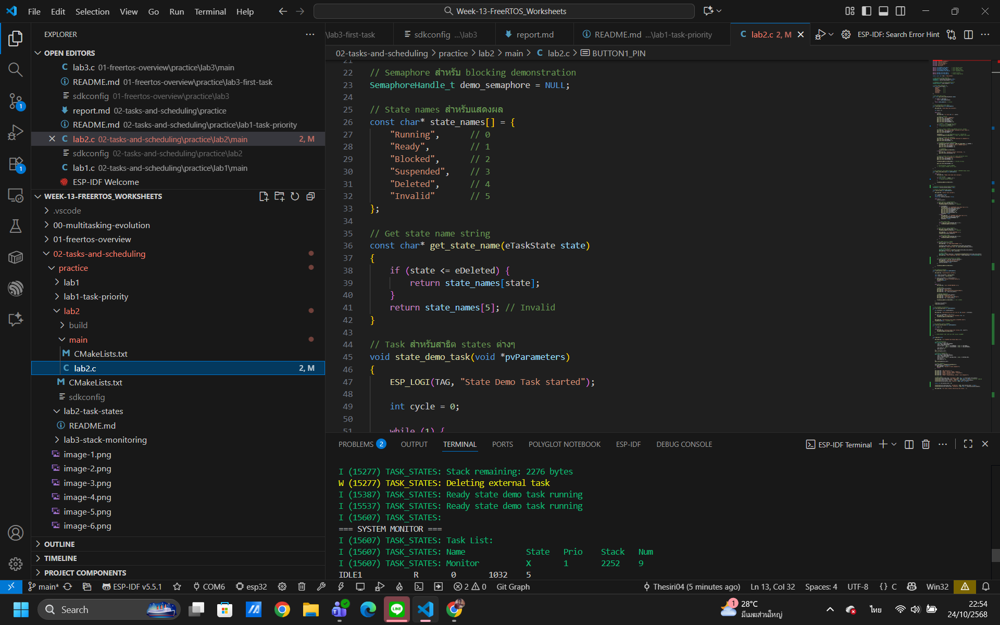
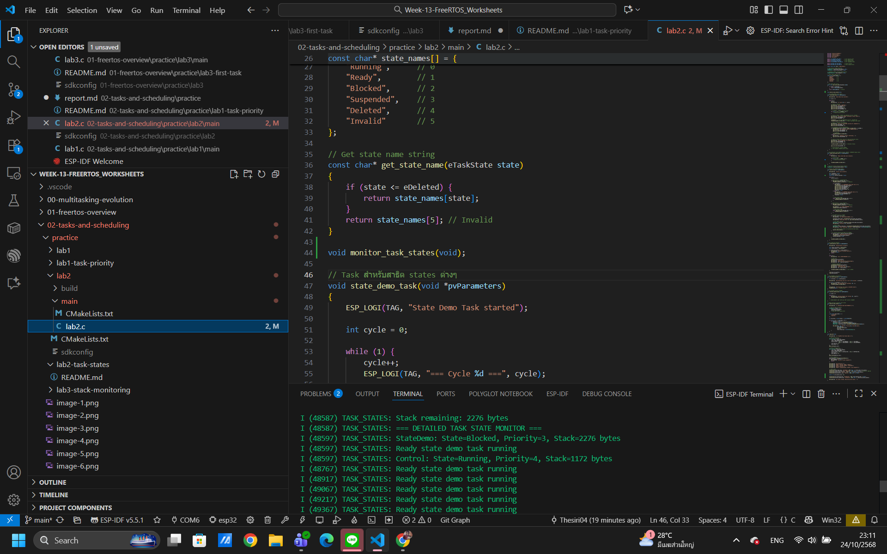
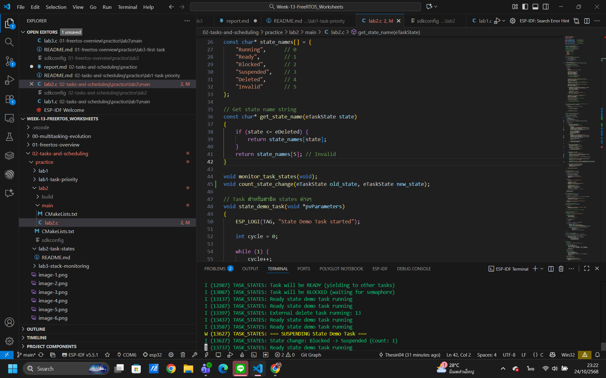
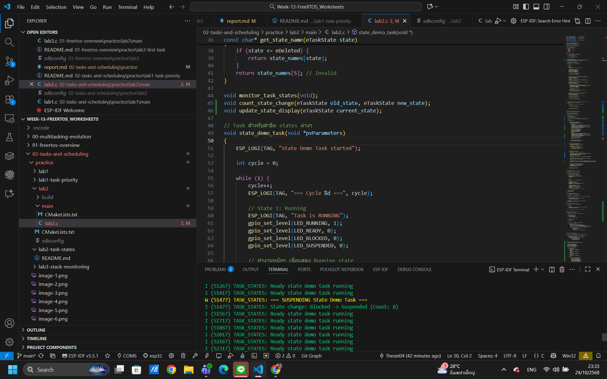
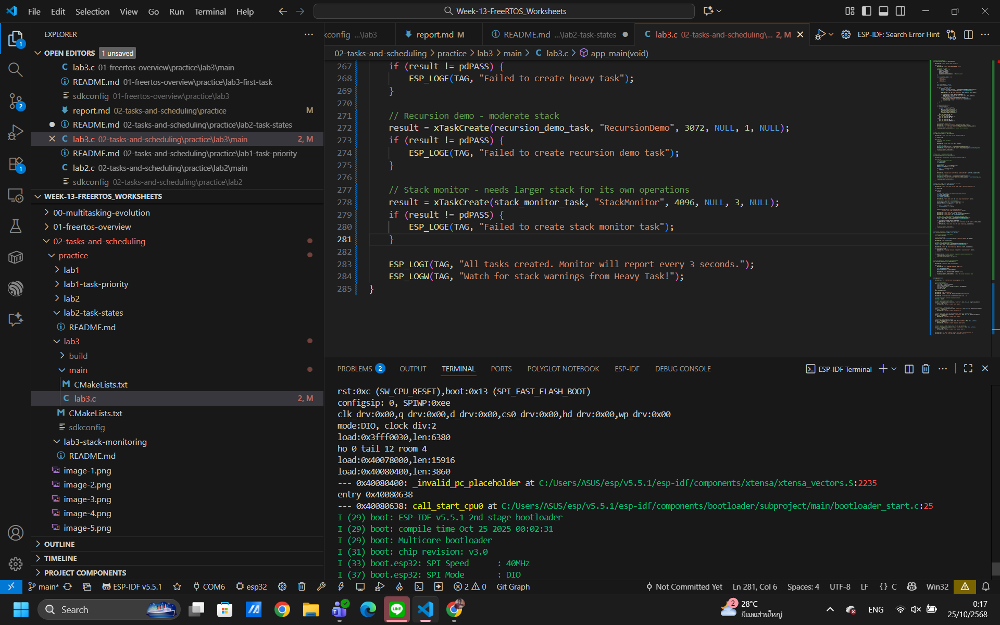
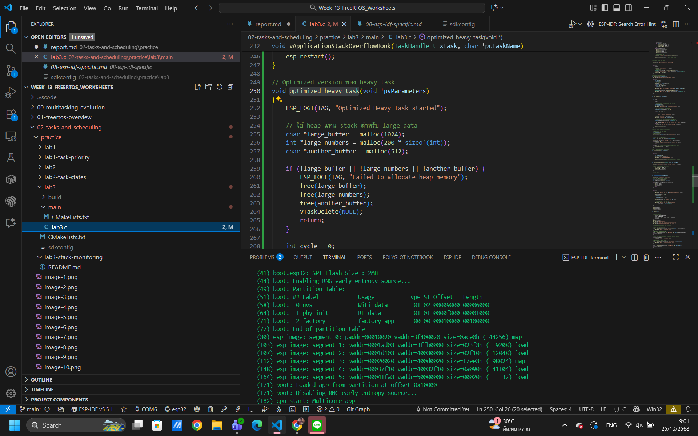

## ผลลัพธ์การทดลอง

## LAB 1
### Step 1: Basic Priority Demonstration 

### Step 2: Round-Robin Scheduling

### Step 3: Priority Inversion Demo

### Ex1

### Ex2

## LAB 2 
### Step 1: Basic Task States Demo

### Step 2: Advanced State Transitions

### Step 3: Task State Monitoring

### Ex1

## Ex 2

TASK_STATES: === SUSPENDING State Demo Task === LED3 ติด

## LAB 3 

